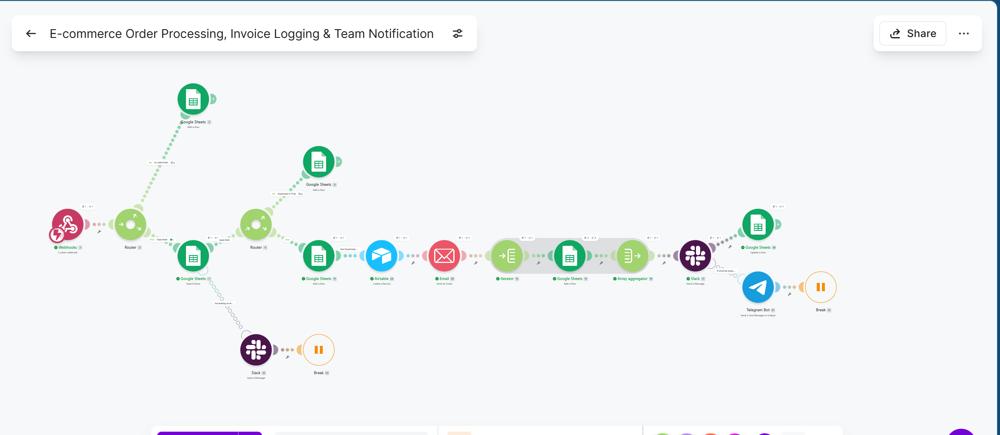
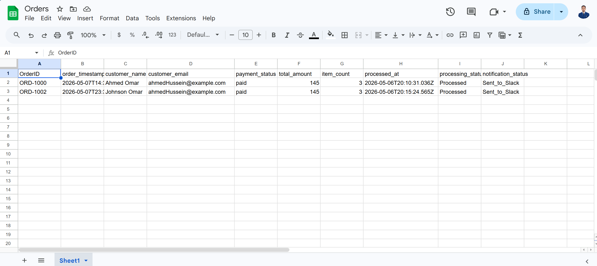
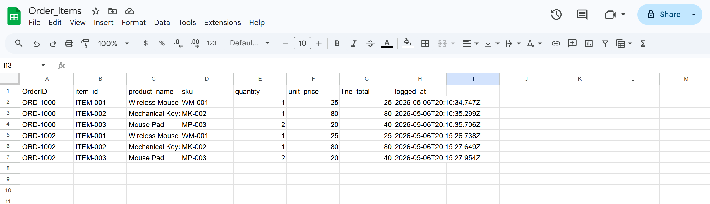
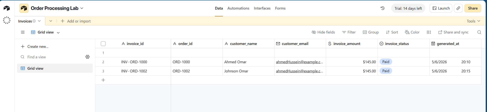
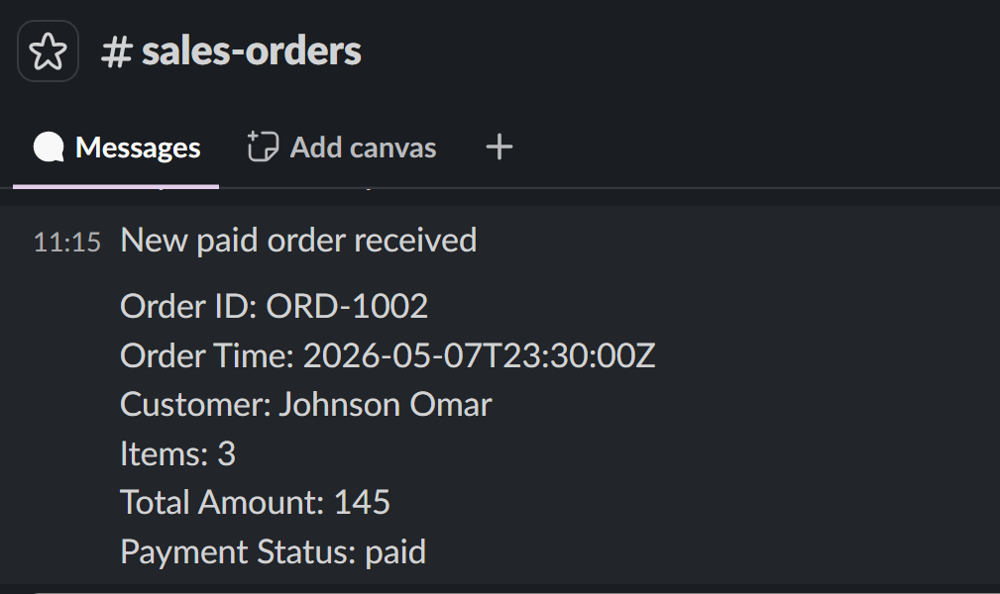
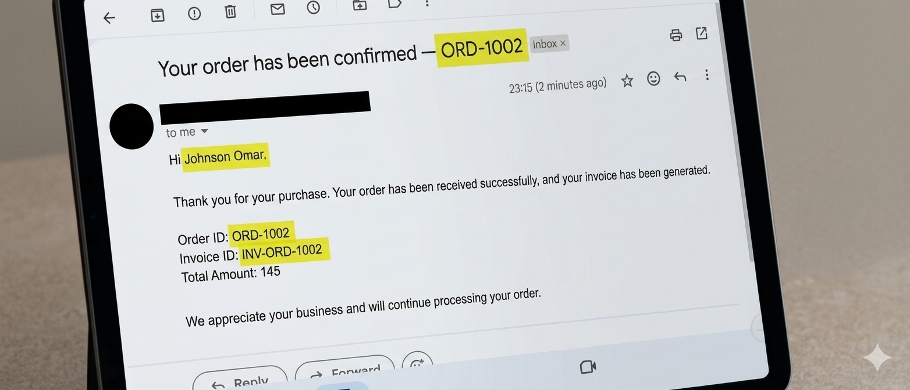

# Project 02 | E-commerce Order Processing, Invoice Logging & Team Notification

A Make.com automation workflow for processing paid e-commerce orders through a webhook, logging structured order and invoice records, sending buyer communication, and notifying internal teams through Slack with Telegram fallback support.

This project demonstrates how Make.com can be used to connect order intake, operations tracking, finance visibility, customer communication, and team notifications into one automated business workflow.

> **Template availability:** A sanitized reference blueprint is included for portfolio purposes. Environment-specific connections, IDs, webhook URLs, and private configuration values were removed or replaced. Manual reconnection and field remapping may be required before reuse.

---

## Overview

This project was built as a practical business automation workflow for handling paid e-commerce orders in a more structured and reliable way.

Instead of treating an order as a single flat record, the workflow separates the process into clear operational stages:

- order intake
- required data validation
- duplicate detection
- order header logging
- line-item logging
- invoice record creation
- buyer communication
- internal team notification
- fallback alerting
- final status updates

The result is a workflow that behaves more like a real internal operations process, not just a simple automation demo.

---

## Business Problem

Many small e-commerce teams still rely on manual steps after an order is placed.

Common problems include:

- orders being copied manually between tools
- duplicate webhook events causing repeated processing
- malformed or incomplete order payloads being missed
- finance records being created late or inconsistently
- line items not being stored in a clean structure
- team members finding out about new orders too late
- notification failures going unnoticed
- limited visibility into what happened during processing

In a real business, these issues can create:

- order confusion
- customer communication delays
- inaccurate reporting
- extra admin work
- weak auditability
- missed internal handoffs
- avoidable operational risk

This workflow was designed to reduce those risks by making the order process more structured, visible, and reviewable.

---

## Solution Overview

The automation receives paid order data through a custom webhook and moves it through a controlled workflow.

At a high level, the workflow:

1. Receives a paid order payload.
2. Checks that the required fields are present.
3. Logs invalid payloads instead of ignoring them.
4. Checks whether the order already exists.
5. Stops duplicate orders from being processed twice.
6. Stores the order header in Google Sheets.
7. Creates an invoice record in Airtable.
8. Sends a buyer confirmation email.
9. Iterates through each order line item.
10. Stores each line item separately.
11. Sends an internal Slack notification.
12. Sends a Telegram fallback alert if Slack fails.
13. Updates the final processing and notification statuses.

This design gives the business a clearer order trail from intake to internal notification.

---

## Architecture

```txt
Paid Order Webhook
        │
        ▼
Make.com Scenario
        │
        ├── Validate Required Fields
        │       └── Invalid Orders → Google Sheets
        │
        ├── Duplicate Check
        │       ├── Duplicate Orders → Google Sheets
        │       └── Lookup Failure → Human Escalation Path
        │
        ├── New Valid Order
        │       ├── Order Header → Google Sheets
        │       ├── Invoice Record → Airtable
        │       ├── Buyer Confirmation → Email
        │       └── Line Items → Iterator → Google Sheets
        │
        └── Internal Notification
                ├── Slack Notification
                └── Telegram Fallback if Slack Fails
````

---

## Tools Used

<p>
  
  
  
  
  
  
  
  
</p>

* **Make.com** — workflow orchestration
* **Custom Webhook** — paid order intake
* **Google Sheets** — operational logging
* **Airtable** — invoice record storage
* **Gmail / Email module** — buyer confirmation email
* **Slack** — internal team notification
* **Telegram Bot** — fallback alerting
* **Postman** — webhook payload testing

---

## What the Workflow Does

* receives a paid order through a custom webhook
* validates required fields before processing
* logs invalid payloads into a dedicated sheet
* checks existing records for duplicate `order_id` values
* logs duplicates separately instead of reprocessing them
* stores the order header in Google Sheets
* creates an invoice record in Airtable
* sends a buyer confirmation email
* iterates through all line items
* stores each line item individually
* sends an internal Slack notification
* falls back to Telegram if Slack delivery fails
* updates final processing and notification statuses

---

## Workflow Logic

1. A custom webhook receives a new paid-order payload.
2. The workflow validates the required fields: `order_id`, `order_timestamp`, and `line_items`.
3. If validation fails, the payload is logged to `Invalid_Orders` and processing stops.
4. If validation passes, existing order records are searched using `order_id`.
5. If the duplicate check itself fails, the workflow escalates to a human-facing error path and stops to avoid unsafe processing.
6. If the `order_id` already exists, the order is logged to `Duplicates` and the workflow ends.
7. If the order is new, the order header is logged in the `Orders` sheet.
8. An invoice record is created in Airtable.
9. A buyer confirmation email is sent.
10. The `line_items` array is iterated so each product can be handled individually.
11. Each line item is logged in the `Order_Items` sheet.
12. The item bundles are regrouped using an Array Aggregator.
13. A Slack summary notification is sent to the internal team.
14. If Slack fails, Telegram sends the fallback alert.
15. The main order record is updated with final processing and notification statuses.

---

## Data Structure

### Google Sheets — Orders

| Field                 | Purpose                     |
| --------------------- | --------------------------- |
| `order_id`            | Unique order reference      |
| `order_timestamp`     | Original order time         |
| `customer_name`       | Buyer name                  |
| `customer_email`      | Buyer email                 |
| `payment_status`      | Payment state               |
| `total_amount`        | Order total                 |
| `item_count`          | Number of line items        |
| `processed_at`        | Automation processing time  |
| `processing_status`   | Final processing state      |
| `notification_status` | Internal notification state |

### Google Sheets — Order_Items

| Field          | Purpose                |
| -------------- | ---------------------- |
| `order_id`     | Parent order reference |
| `item_id`      | Item reference         |
| `product_name` | Product name           |
| `sku`          | Product SKU            |
| `quantity`     | Quantity ordered       |
| `unit_price`   | Price per unit         |
| `line_total`   | Item total             |
| `logged_at`    | Item logging time      |

### Google Sheets — Duplicates

| Field              | Purpose                                 |
| ------------------ | --------------------------------------- |
| `order_id`         | Duplicate order reference               |
| `order_timestamp`  | Original order time                     |
| `customer_name`    | Buyer name                              |
| `customer_email`   | Buyer email                             |
| `total_amount`     | Order total                             |
| `detected_at`      | Duplicate detection time                |
| `duplicate_reason` | Why the record was treated as duplicate |

### Google Sheets — Invalid_Orders

| Field               | Purpose                                  |
| ------------------- | ---------------------------------------- |
| `received_at`       | Time the invalid payload was received    |
| `raw_order_id`      | Order ID if available                    |
| `customer_name`     | Buyer name if available                  |
| `customer_email`    | Buyer email if available                 |
| `validation_reason` | Reason the payload failed validation     |
| `raw_payload_note`  | Sanitized note about the invalid payload |

### Airtable — Invoices

| Field            | Purpose                      |
| ---------------- | ---------------------------- |
| `invoice_id`     | Invoice reference            |
| `order_id`       | Related order                |
| `customer_name`  | Buyer name                   |
| `customer_email` | Buyer email                  |
| `invoice_amount` | Invoice total                |
| `invoice_status` | Invoice state                |
| `generated_at`   | Invoice record creation time |

---

## Screenshots

### Scenario Overview



### Order Sheet



### Order Items Sheet



### Airtable Invoice Storage



### Slack Notification



### Buyer Follow-up Email



---

## Key Skills Demonstrated

* webhook-based workflow intake
* Make.com scenario design
* validation and branching logic
* duplicate prevention
* multi-step business process automation
* Iterator usage for line-item handling
* Array Aggregator usage after item-level processing
* structured logging across multiple systems
* Google Sheets as lightweight operations storage
* Airtable record creation
* buyer-facing email automation
* internal team notification design
* fallback alerting
* workflow state and status updates
* human escalation for failure scenarios
* sanitized documentation for public portfolio use

---

## Human Escalation Design

A useful automation should not continue blindly when the data or process becomes unsafe.

This workflow includes escalation thinking for situations where human review is better than automatic continuation.

### Human escalation happens when:

* the workflow cannot safely validate required input
* duplicate verification cannot be completed reliably
* the primary internal notification channel fails

### Why this matters

A business does not only need automation. It needs safe automation.

This workflow is designed so that:

* invalid or risky cases are surfaced
* duplicate uncertainty is escalated instead of guessed
* Slack failure does not leave the team blind
* humans can step in when the workflow reaches a decision point that should not be handled silently

This makes the workflow more trustworthy for real operations.

---

## Notification Design

### Buyer Email

The workflow sends a buyer-facing confirmation email after the invoice record is created.

This gives the customer confirmation that the order was received and helps reduce uncertainty after payment.

### Slack Notification

Slack is used as the primary internal team notification channel.

It gives the operations team quick visibility when a paid order has been processed.

### Telegram Fallback

Telegram is used as a fallback alert channel if Slack delivery fails.

This prevents the business from depending on a single notification channel.

### Error / Escalation Behavior

If a critical processing step cannot be safely completed, the workflow is designed to escalate rather than continue silently.

---

## Business Outcome

This automation improves order operations in four practical ways.

### 1. Better operational visibility

Orders are classified, logged, and tracked with status fields instead of being treated as one-off events.

### 2. Better data structure

Order headers and line items are separated properly, which makes reporting and downstream operations easier.

### 3. Better exception handling

Invalid payloads, duplicate events, and duplicate-check failures are not silently ignored. They are surfaced for review or routed away from normal processing.

### 4. Better communication

Both internal teams and the buyer receive relevant communication at the right stage of the workflow.

---

## Expected ROI / Business Value

This project is a portfolio workflow, so it does **not** claim measured production ROI.

However, the business value is realistic.

In a real environment, a workflow like this can help reduce:

* manual order logging time
* duplicate-processing mistakes
* time spent investigating malformed orders
* handoff delays between operations and finance
* notification gaps when the main channel fails
* repeated copy-paste work between business tools

### Grounded impact examples

Depending on order volume, even a modest implementation could create value by:

* saving a few minutes per order that would otherwise be spent on manual logging
* reducing duplicate-handling mistakes from repeated webhook events
* making invalid submissions reviewable instead of invisible
* giving finance a cleaner starting point through invoice records
* reducing time-to-awareness for internal teams through automated alerts
* creating a clearer audit trail for order operations

The exact ROI depends on:

* order volume
* current manual process maturity
* team size
* frequency of duplicate or malformed payloads
* internal cost of errors and delays
* number of tools involved in the order process

The claim is not that this workflow magically solves every operations problem.
The claim is that it targets real sources of operational waste.

---

## Trade-Offs & Assumptions

This project makes a few deliberate design choices to stay practical and realistic.

### Trade-off 1: Paid orders only

The workflow focuses on **paid orders only**.

This keeps the scenario focused on confirmed-order handling instead of mixing it with abandoned checkout, failed payment, or pending-payment recovery workflows.

### Trade-off 2: Invoice record, not invoice PDF

The workflow creates a structured invoice record in Airtable instead of generating a full invoice PDF.

This is a practical middle ground that supports finance visibility without adding unnecessary complexity to the portfolio version.

### Trade-off 3: Google Sheets and Airtable both used

Google Sheets is used for operational logs, while Airtable is used for invoice records.

This is slightly more complex than using one tool only, but it reflects how many real businesses use different tools for different parts of their workflow.

### Trade-off 4: Sanitized public blueprint

The shared blueprint is intentionally sanitized for safety.

This makes it safe for a public GitHub portfolio, but it means the scenario may require reconnection, remapping, and testing before reuse.

### Trade-off 5: Fallback alerting instead of full retry infrastructure

Telegram is used as a fallback alert when Slack fails.

A production system could later add more advanced retry logic, monitoring, or incident reporting.

---

## Edge Cases Handled

* missing required fields
* empty or malformed line items
* duplicate `order_id`
* duplicate-check lookup failure
* Slack notification failure
* invalid payload logging
* multi-line-item orders
* status tracking after processing

---

## Example Business Use Cases

This workflow pattern can be adapted for:

* e-commerce order operations
* paid checkout workflows
* invoice tracking
* buyer confirmation workflows
* internal order notifications
* operations team alerts
* order record management
* finance handoff workflows
* Shopify or WooCommerce order extensions
* Stripe payment workflow extensions
* lightweight back-office automation for small businesses

---

## Security & Sanitization

The public version of this project is sanitized.

Sensitive values were removed or replaced, including:

* webhook URLs
* private connection IDs
* email addresses
* company-specific names
* sheet IDs
* Airtable base/table details
* Telegram bot information
* Slack workspace/channel references
* private internal identifiers

Before using this workflow in a real environment, the blueprint should be reviewed and reconnected with secure production credentials.

---

## Files Included

This project folder includes:

* `README.md`
* `workflow-notes.md`
* sanitized Make.com blueprint reference
* screenshots folder

Example structure:

```txt
project-02-ecommerce-order-processing/
│
├── README.md
├── workflow-notes.md
├── project-02-blueprint-sanitized-reference.json
└── screenshots/
    ├── Scenario_overview.png
    ├── Order_sheet.png
    ├── Order_Items_sheet.png
    ├── Storing_invoice_Airtable.png
    ├── Slack_notification.png
    └── Followup_Email.png
```

---

## Future Improvements

Possible future improvements include:

* real invoice PDF generation
* Stripe payment confirmation integration
* Shopify or WooCommerce source integration
* accounting platform integration
* fulfillment handoff workflow
* item-level validation rules
* richer internal alert formatting
* retry pattern for customer email failures
* dashboard summary for daily processed orders
* CRM update after purchase
* customer segmentation based on order value
* support ticket creation for failed or risky orders

---

## Why This Project Matters

This project shows that Make.com can be used for more than simple form automation.

It demonstrates workflow thinking across:

* intake
* validation
* duplicate prevention
* structured storage
* line-item processing
* invoice record creation
* customer communication
* team notification
* fallback alerting
* human escalation
* public documentation and sanitization

For recruiters or clients, the point is not just that the scenario runs.

The point is that the workflow was designed with business consequences in mind: what should be automated, what should be logged, what should notify the team, and where human review is safer than silent automation.

---

## Author

**Mohamed Yousuf Hussein**
**AI Engineer | Workflow Automation**

<p>
  <a href="https://github.com/6302Mohamed">
    
  </a>
</p>
```
