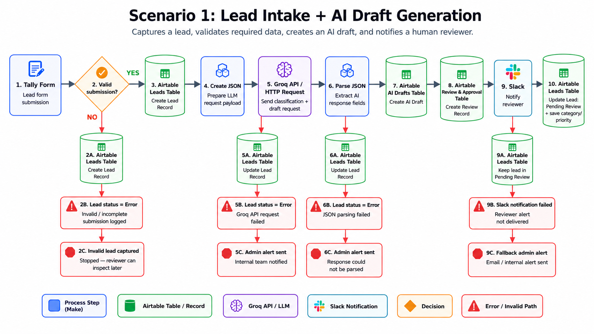
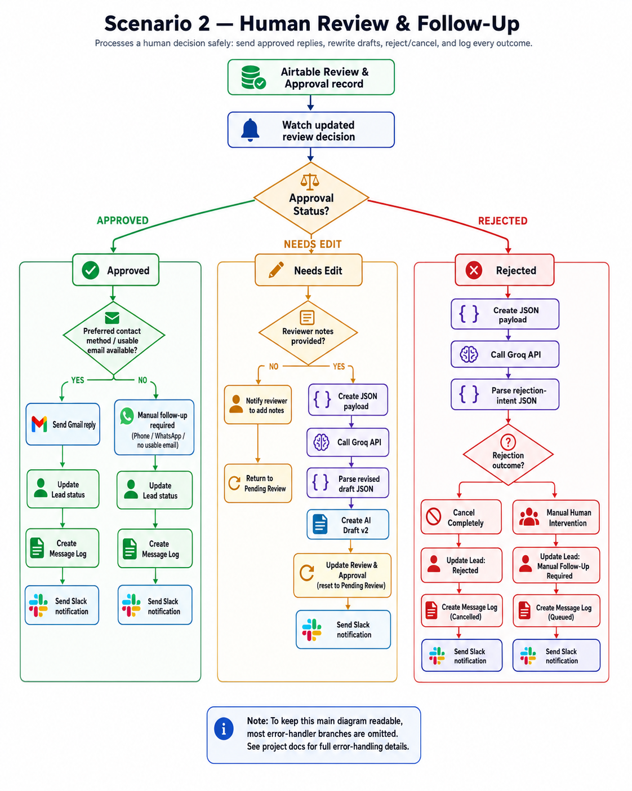

<div align="center">

# AI Lead Review & Follow-Up System

### Human-in-the-loop AI automation for lead intake, review, follow-up, and audit logging.

<p>
  
  
  
  
  
  
</p>

<p>
  <strong>AI Drafting</strong> ·
  <strong>Human Review</strong> ·
  <strong>Safe Follow-Up</strong> ·
  <strong>Error Handling</strong> ·
  <strong>Audit Logging</strong>
</p>

</div>

---

## Overview

The **AI Lead Review & Follow-Up System** is a human-in-the-loop AI automation project built with **Make.com, Airtable, Tally, Groq, Gmail, and Slack**.

The system captures incoming leads, validates required information, generates AI-assisted draft replies, routes each draft for human review, and safely processes the reviewer’s decision.

AI is used to support classification, summarization, drafting, rewriting, and rejection-intent routing. Final customer-facing actions remain controlled by a human reviewer.


---

## Demo Video

**Demo video:** Coming soon

A short walkthrough video will be added here showing:

* lead submission through the intake form,
* AI draft generation,
* Airtable review workflow,
* approved email follow-up,
* needs-edit revision loop,
* rejected lead routing,
* message logging and status updates.

---

## Problem

Many small businesses receive leads through forms, websites, social media, referrals, or portfolio pages. These leads often need to be reviewed, categorized, prioritized, answered, or manually followed up.

A simple automation such as:

```text
form submission → AI reply → email
```

is risky because:

* incomplete submissions may be processed incorrectly,
* AI-generated replies may be sent without review,
* WhatsApp and phone follow-ups usually require human judgment,
* failed sends may go unnoticed,
* rejected leads may not be logged properly,
* there may be no clear audit trail of what happened.

This project solves that by adding validation, human review, structured AI outputs, manual fallback paths, status tracking, and message logging.

---

## Solution

The system uses two Make.com scenarios connected through Airtable.

| Scenario                                             | Purpose                                                                                                      |
| ---------------------------------------------------- | ------------------------------------------------------------------------------------------------------------ |
| **Scenario 1 — Lead Intake + AI Draft Generation**   | Captures a lead, validates input, creates an AI draft, creates a review record, and notifies the reviewer.   |
| **Scenario 2 — Human Review + Follow-Up Processing** | Processes the reviewer’s decision and either sends, revises, queues, cancels, or logs the follow-up outcome. |

The workflow separates AI assistance from final approval. This keeps the system useful without allowing the AI model to independently send customer-facing messages.

---

## Tech Stack

| Tool         | Role                                                                           |
| ------------ | ------------------------------------------------------------------------------ |
| **Tally**    | Lead intake form.                                                              |
| **Make.com** | Workflow orchestration, routing, validation, API calls, and automation logic.  |
| **Airtable** | Operational database for leads, AI drafts, review decisions, and message logs. |
| **Groq API** | LLM-powered classification, drafting, rewriting, and rejection-intent routing. |
| **Gmail**    | Sends approved email follow-ups.                                               |
| **Slack**    | Sends reviewer, admin, and manual follow-up notifications.                     |

---

## Architecture

### Scenario 1 — Lead Intake + AI Draft Generation

Scenario 1 captures a lead from Tally, validates the submission, stores the lead in Airtable, sends structured context to Groq, parses the AI response, creates an AI draft, creates a human review record, and notifies the reviewer in Slack.



### Scenario 2 — Human Review + Follow-Up Processing

Scenario 2 watches the Airtable review queue and processes the human reviewer’s decision.

It supports approved email sending, manual follow-up queueing, AI-powered draft revisions, rejected lead routing, cancellation logging, human intervention routing, Slack notifications, and message logs.



---

## Key Features

* Lead intake from Tally form.
* Required-field validation before AI processing.
* Invalid submissions are stored and marked as errors.
* AI-generated lead classification.
* AI-generated priority estimation.
* AI-generated lead summary.
* AI-generated draft reply.
* Structured JSON prompting and JSON parsing.
* Human review and approval workflow.
* Reviewer can approve, request edits, or reject.
* AI rewrite loop for `Needs Edit` decisions.
* AI-assisted rejection intent routing.
* Manual follow-up queue for WhatsApp, phone, or unclear cases.
* Gmail delivery only after human approval.
* Slack alerts for reviewers and manual action.
* Airtable message logging for sent, queued, failed, and cancelled outcomes.
* Error handling for invalid input, Groq failures, JSON parse failures, Gmail failures, and Slack failures.
* Sanitized Make blueprints for portfolio review.

---

## Workflow Summary

### 1. Lead Intake

A lead submits a Tally form with contact details, project information, preferred contact method, and an original message.

Make receives the submission and validates whether required fields are available.

If the submission is valid, a lead record is created in Airtable.

If the submission is invalid, the lead is still saved but marked with:

```text
Lead Status = Error
```

This prevents incomplete data from continuing into AI drafting while still preserving the submission for inspection.

---

### 2. AI Draft Generation

For valid leads, Make creates a structured JSON request and sends it to Groq.

Groq returns structured JSON containing:

* lead category,
* priority,
* lead summary,
* draft reply,
* confidence notes.

Make parses the JSON response and stores the result in the `AI Drafts` table.

---

### 3. Human Review

Make creates a record in the `Review & Approval` table and sets the review status to:

```text
Pending Review
```

A Slack notification is sent to the reviewer.

The reviewer can choose:

* `Approved`
* `Needs Edit`
* `Rejected`

---

### 4. Approved Follow-Up

If the reviewer approves the reply, Scenario 2 checks the lead’s preferred contact method.

If email is allowed and a usable email exists:

* Gmail sends the approved reply,
* the lead is marked as `Sent`,
* a `Message Log` record is created,
* Slack confirms delivery.

If the lead prefers WhatsApp, phone, or has no usable email:

* no automatic customer message is sent,
* the lead is marked as `Manual Follow-Up Required`,
* a manual follow-up log is created,
* Slack alerts the team.

---

### 5. Needs Edit Revision Loop

If the reviewer selects `Needs Edit`, the system checks whether reviewer notes were provided.

If notes are missing:

* the reviewer is asked to add notes,
* the record returns to or remains in `Pending Review`,
* no AI rewrite is requested.

If notes are present:

* Make creates a revision JSON request,
* Groq rewrites the draft,
* Make parses the revised response,
* a new `AI Drafts` record is created as `v2`,
* the review is reset to `Pending Review`,
* Slack notifies the reviewer that the revised draft is ready.

---

### 6. Rejected Lead Routing

If the reviewer rejects the lead, the system uses Groq to classify the reviewer’s rejection intent.

The rejected lead is routed to one of two outcomes:

| Outcome                       | Meaning                                                                                                         |
| ----------------------------- | --------------------------------------------------------------------------------------------------------------- |
| **Cancel Completely**         | No customer follow-up should be sent. The lead is marked `Rejected` and logged as `Cancelled`.                  |
| **Manual Human Intervention** | The case requires custom human handling. The lead is marked `Manual Follow-Up Required` and logged as `Queued`. |

The human reviewer makes the rejection decision. AI only helps classify the operational handling of that decision.

---

## Airtable Data Model

The Airtable base contains four connected tables.

| Table                 | Purpose                                                                                             |
| --------------------- | --------------------------------------------------------------------------------------------------- |
| **Leads**             | Stores the original lead submission and current lead status.                                        |
| **AI Drafts**         | Stores AI-generated drafts, summaries, categories, priorities, prompt versions, and draft versions. |
| **Review & Approval** | Stores the human review decision, approved reply, reviewer notes, and related lookup fields.        |
| **Message Log**       | Stores the final communication outcome: sent, queued, failed, or cancelled.                         |

The schema uses linked records and lookup fields so each lead can be traced across its AI draft, review decision, and final communication outcome.

The Airtable base also uses filtered views to support automation routing and human operations. For example, Scenario 2 watches the `Decision Processing` view in the `Review & Approval` table so only actionable review decisions are processed.

Full schema documentation:

[docs/airtable-schema.md](docs/airtable-schema.md)

---

## Prompt Engineering and Safety Design

Prompt engineering was treated as part of the system design.

The prompts were designed to:

* separate system instructions from lead-provided context,
* request structured JSON output,
* avoid unsafe promises,
* avoid claiming a project is accepted,
* keep the tone professional,
* adapt draft style to contact preference,
* produce confidence notes,
* support reviewer-guided rewrites,
* classify rejection intent safely.

Prompt design documentation:

[docs/prompt-engineering-and-safety.pdf](docs/prompt-engineering-and-safety.pdf)

---

## Error Handling

The project includes explicit error handling for important failure points.

Examples:

* invalid or incomplete form submissions,
* Groq API failures,
* JSON parse failures,
* missing reviewer notes,
* Gmail send failures,
* Slack notification failures,
* manual follow-up routing,
* cancelled leads.

The goal is to make failed automation visible instead of silent.

Full error handling documentation:

[docs/error-handling.md](docs/error-handling.md)

---

## Project Documentation

| Document                                                                         | Purpose                                                                           |
| -------------------------------------------------------------------------------- | --------------------------------------------------------------------------------- |
| [docs/architecture.md](docs/architecture.md)                                     | Explains the system architecture and how the components work together.            |
| [docs/airtable-schema.md](docs/airtable-schema.md)                               | Documents Airtable tables, fields, dropdowns, views, linked records, and lookups. |
| [docs/scenario-logic.md](docs/scenario-logic.md)                                 | Explains the logic of Scenario 1 and Scenario 2.                                  |
| [docs/error-handling.md](docs/error-handling.md)                                 | Details failure paths, status outcomes, and recovery behavior.                    |
| [docs/prompt-engineering-and-safety.pdf](docs/prompt-engineering-and-safety.pdf) | Explains prompt design, JSON contracts, scope control, and safety decisions.      |

---

## Screenshots

Screenshots are included to show the system in operation.

| Screenshot                                                  | Description                       |
| ----------------------------------------------------------- | --------------------------------- |
| `screenshots/scenario-1-lead-intake-ai-draft-overview.png`  | Make Scenario 1 overview.         |
| `screenshots/scenario-2-human-review-followup-overview.png` | Make Scenario 2 overview.         |
| `screenshots/airtable-leads.png`                            | Airtable Leads table.             |
| `screenshots/airtable-ai-drafts.png`                        | Airtable AI Drafts table.         |
| `screenshots/airtable-review-approval.png`                  | Airtable Review & Approval table. |
| `screenshots/airtable-message-log.png`                      | Airtable Message Log table.       |
| `screenshots/slack-lead-cancelled-alert.png`                | Slack notification example.       |
| `screenshots/gmail-approved-email.png`                      | Approved email follow-up example. |

---

## Make Blueprints

Sanitized Make blueprints are included for review.

| Blueprint                                                                                                                | Description                     |
| ------------------------------------------------------------------------------------------------------------------------ | ------------------------------- |
| [blueprints/scenario-1-lead-intake-ai-draft-sanitized.json](blueprints/scenario-1-lead-intake-ai-draft-sanitized.json)   | Scenario 1 sanitized blueprint. |
| [blueprints/scenario-2-human-review-followup-sanitized.json](blueprints/scenario-2-human-review-followup-sanitized.json) | Scenario 2 sanitized blueprint. |

Sensitive values have been removed or replaced with placeholders.

Redacted items include:

* API keys,
* Make connection IDs,
* Airtable base and field IDs,
* Slack workspace/channel identifiers,
* Gmail addresses,
* private account references.

Because the blueprints are sanitized, importing them into another Make account requires reconnecting services and remapping account-specific fields.

---

## Engineering Decisions

### Human Review Before Sending

AI-generated replies are never sent directly.

The workflow creates a review record first, and the reviewer must approve the reply before Gmail delivery can happen.

This protects the business from sending inaccurate, overly confident, or inappropriate AI-generated messages.

---

### Structured JSON Output

The system uses structured JSON prompts and Parse JSON modules instead of treating AI output as plain text.

This allows Make to reliably map AI outputs into Airtable fields such as:

* category,
* priority,
* summary,
* draft reply,
* confidence notes,
* rejection intent.

---

### Manual Follow-Up for Non-Email Channels

WhatsApp and phone follow-ups are queued for human action instead of being automated.

This keeps the system realistic and safer because phone calls and WhatsApp messages often require direct human judgment.

---

### Relational Airtable Design

The project does not store everything in one table.

Instead, Airtable is structured into separate tables for:

* original lead data,
* AI draft versions,
* human review decisions,
* final communication outcomes.

This improves traceability and makes the workflow easier to audit.

---

### Rejection Intent Routing

Rejected leads are not all treated the same.

The system uses AI to interpret reviewer notes and route the rejected lead into:

* `Cancel Completely`
* `Manual Human Intervention`

This adds flexibility while keeping the reviewer in control.

---

## Main Challenges and Resolutions

### 1. Avoiding a Basic Form-to-Email Automation

A simple form-to-email workflow would have been easy to build, but it would not demonstrate safe AI automation.

The project was redesigned around a human review table so AI can draft, but a human controls the final decision.

---

### 2. Designing the Airtable Schema

One of the most important challenges was designing Airtable as more than a simple spreadsheet.

The system needed to track:

* the original lead,
* AI-generated draft versions,
* human approval decisions,
* follow-up outcomes,
* manual queues,
* cancelled leads,
* failed sends,
* operational notes.

The solution was to separate the workflow into four tables:

```text
Leads
AI Drafts
Review & Approval
Message Log
```

Linked records and lookup fields were used so each lead could be traced from intake to final outcome without duplicating unnecessary data.

---

### 3. Building Useful Airtable Views and Filters

Another challenge was creating views that support both automation and human review.

The workflow needed views for:

* pending reviews,
* decision processing,
* sent leads,
* manual follow-up,
* rejected leads,
* error leads,
* queued follow-ups,
* failed messages,
* portfolio screenshots.

The most important automation view is `Decision Processing`, which allows Scenario 2 to watch only review records that require action.

This helped keep the automation focused, reduced unnecessary processing, and made the Airtable base easier to operate.

---

### 4. Handling Different Contact Preferences

The system needed to support email, WhatsApp, phone, no preference, and missing contact preference.

The solution was to separate automatic email delivery from manual follow-up.

Email can be automated after approval. WhatsApp, phone, missing email, and sensitive cases are queued for human action.

---

### 5. Making AI Output Usable in Automation

AI output can be inconsistent if it is returned as plain text.

The solution was to request JSON output and parse it before mapping fields into Airtable.

This made the AI output usable by Make modules and safer for downstream automation.

---

### 6. Managing the Needs-Edit Loop

When a reviewer requests edits, the AI should not guess what to change.

The solution was to require reviewer notes before triggering the rewrite path.

If notes are missing, the workflow asks the reviewer to add notes and returns the review to `Pending Review`.

---

### 7. Handling Rejections Safely

A rejected lead can mean different things. It may mean no follow-up, or it may mean a human should handle the case manually.

The solution was to use AI only for rejection-intent classification, not for final authority.

The reviewer decides to reject. AI only helps route the operational outcome.

---

### 8. Keeping Long Scenarios Understandable

The full Make scenarios include multiple routers, API calls, parsing modules, updates, notifications, and error paths.

To keep the project understandable, the main diagrams show the important business paths, while the detailed failure behavior is documented separately.

---

## Future Improvements

This version is a working portfolio prototype. Future versions could improve the system further.

### 1. Admin Dashboard

Add a dashboard showing:

* pending reviews,
* high-priority leads,
* queued manual follow-ups,
* failed sends,
* cancelled leads,
* average response time.

### 2. Duplicate Lead Detection

Add duplicate detection using:

* email,
* phone,
* company,
* recent submission window,
* similar message content.

### 3. Output Evaluation

Evaluate AI outputs for:

* tone,
* completeness,
* safety,
* JSON validity,
* category accuracy,
* priority accuracy,
* reviewer edit frequency.

### 4. Role-Based Review Controls

Add role separation for:

* reviewer,
* manager,
* admin,
* sales owner.

This would support larger teams and stricter approval flows.

### 5. CRM Integration

Extend the workflow to tools such as:

* HubSpot,
* Pipedrive,
* Notion,
* Salesforce.

Airtable works well for this prototype, but production teams may want CRM integration.

### 6. Customer History

Add customer history checks before drafting a reply.

This would allow more personalized and context-aware follow-ups.

### 7. Prompt Version Tracking

Prompt versions are already stored, but a future version could store full prompt metadata in a dedicated table.

This would make prompt evaluation and comparison easier.

---

## Security and Privacy

The repository does not include live credentials.

Sanitized files are used for public review.

Removed or redacted items include:

* API keys,
* Make connection IDs,
* Airtable base and field IDs,
* Slack workspace/channel identifiers,
* Gmail addresses,
* private account references.

The included blueprints are for review and demonstration. They require reconnection and remapping before use in another environment.

---

## Learning Outcomes

This project demonstrates practical AI-assisted automation design, including:

* Make.com scenario architecture,
* Airtable relational schema design,
* human-in-the-loop workflow design,
* structured prompting,
* JSON-based AI outputs,
* API integration using HTTP modules,
* Slack and Gmail automation,
* error handling,
* manual fallback design,
* audit logging,
* portfolio-quality technical documentation.

The main engineering lesson is that the value of an AI automation system is not only in calling an AI model. The value is in designing the surrounding workflow: validation, approval, structured outputs, fallback paths, logging, and recovery behavior.

---

## Repository Status

This project is complete as a portfolio case study.

Included:

* working Make scenarios,
* sanitized scenario blueprints,
* Airtable schema,
* diagrams,
* screenshots,
* architecture documentation,
* prompt engineering documentation,
* error-handling documentation.

The system is suitable as a demonstration of practical AI-assisted business automation with human review and safe follow-up processing.

---

## Author

**Mohamed Yousuf Hussein**
**AI Agent Engineer | Automation Builder | Workflow Designer**

<p>
  <a href="https://github.com/6302Mohamed">
    
  </a>
</p>
